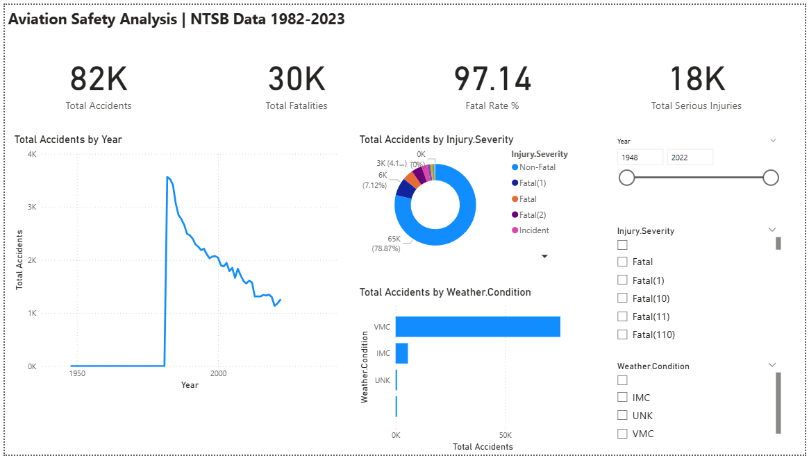
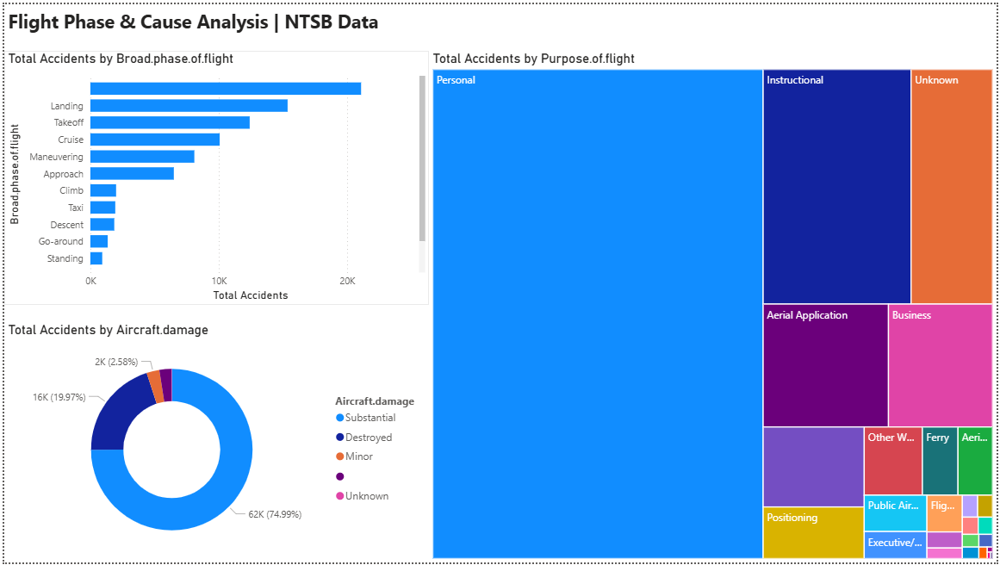
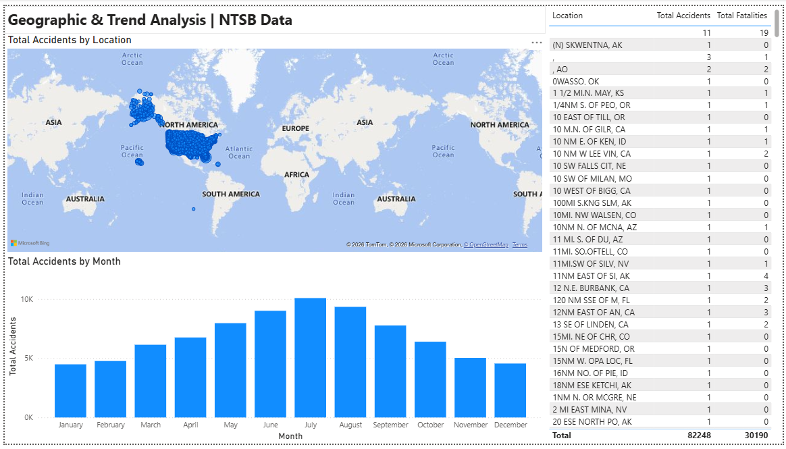

# Aviation Safety Dashboard | Power BI

## Objective
Analyze 80,000+ NTSB aviation accident records to identify 
safety patterns across flight phases, weather conditions, 
and geographic regions in the United States.

## Dataset
- Source: NTSB Aviation Accident Database (Kaggle)
- Records: 80,000+ incidents (1982–2023)
- Format: CSV

## Tools Used
- Power BI Desktop
- Power Query (data cleaning)
- DAX (measures & calculations)

## Key Findings
- Landing and Takeoff phases account for highest accidents
- Summer months (July/August) have most accidents
- Fatal accidents have declined significantly from 1982 to 2023
- VMC weather conditions have more accidents than IMC

## Report Pages
1. Overview Dashboard — KPIs, severity breakdown, trends
2. Flight Phase Analysis — accident distribution by phase
3. Geographic Trends — state-wise map and monthly patterns

## 📸 Dashboard Screenshots
### Page 1 - Overview

### Page 2 - Flight Phase Analysis

### Page 3 - Geographic Trends

